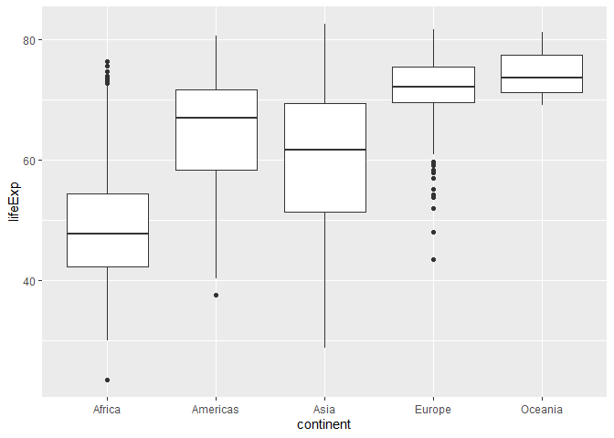

<!-- README.md is generated from README.Rmd. Please edit that file -->

# quickplot

<!-- badges: start -->

<!-- badges: end -->

The purpose of quickplot is to produce `ggplot` in a more convenient
way. It can make a beautiful ggplot using a single function.

## Installation

You can install the released version of quickplot from
[CRAN](https://CRAN.R-project.org) with:

``` r
install.packages("quickplot")
```

And the development version from [GitHub](https://github.com/) with:

``` r
# install.packages("devtools")
devtools::install_github("Yifan-Yin/quickplot")
```

## Basic Usage

Make a boxplot to visualize the distribution of life Expectancy in
different different continents by using the `ggboxplot()` function.

``` r
library(quickplot)
library(gapminder)
#> Warning: package 'gapminder' was built under R version 4.0.3
## use ggboxplot to make a boxplot
ggboxplot(gapminder, categorical_variable = 'continent', numeric_variable = 'lifeExp')
```



## The Procedure of How to Make This Package

1.  **create\_package()**

> The first step is that I called `create_package('H:/quickplot')` in
> the console to create a package in the specific directory.

2.  **use\_github()**

> I called `use_git()` in the console to use the vision control system.

3.  **use\_r()**

> I called `use_r('ggboxplot')` in the console which creates a new R
> file.

> In the *ggboxplot.r* file, I created a function `ggboxplot()`, which
> can produce a boxplot using `ggplot()` and `geom_boxplot()`.

4.  **use\_package()**

> Because I used functions that are from other packages, I called
> `use_package('ggplot2')`, `use_package('purrr')`, and
> `use_package('dplyr')` to import the functions from these packages.

5.  **load\_all()**

> Then I called `load_all()` in the console, and tested whether the
> `ggboxplot()` worked correctly.

6.  **Edit DESCRIPTION**

> I opened the DESCRIPTION file in *R Studio*, and edited the content. I
> added my personal information to the *author*, and also added
> information about the *title* and the *description*.

7.  **use\_mit\_license()**

> I called `use_mit_license('Yifan Yin')` to add a MIT license to the
> package.

8.  **roxygen2**

> I called `library(roxygen2)` in the console, and inserted *roxygen
> skeleton* to the code. Then I edited the definition of the function
> `ggboxplot()`.

9.  **document()**

> I called `document()` in the console to make the documentation of the
> function.

10. **use\_testthat()**

> I called `use_testthat()` in the console to make a *testthat.r* file
> to test the package. Then I called `use_test('ggboxplot')` to test the
> specific function, and run `test()` to see the result.

11. **use\_vignette()**

> I called `use_vignette('vignette')` to create a vignette folder.

12. **use\_readme\_rmd()** and *build\_readme()*

> I called `use_readme_rmd()` to create a README.Rmd file, and called
> `build_readme()` to create a README.md file
